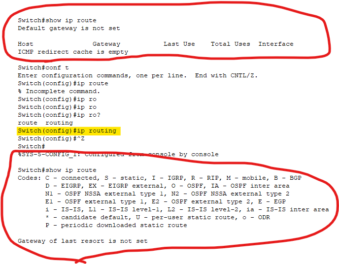

Index:
[toc]

# 想在VLAN間路由
由於VLAN有著將LAN切開的特性，因此網管人員很常利用VLAN劃分出不同區域的網路並分配不同子網
這種拓譜之下的VLAN如何路由?

很簡單，便是每個VLAN的1個Port接到Router上然後把路由的問題丟給Router
這麼做簡單暴力，但是Router上面的Port遠比Switch珍貴，而且組織的擴大除了Router數量的嚴重不足Switch的維護成本與需要數量也會因此水漲船高
那還記得[VLAN](VLAN.md)這篇的內容嗎，想在VLAN間路由將利用802.1q來完成我們的目標

# 如何透過最小的開銷在Switch與Router上完成VLAN路由?
前面提到，由於Router的Port很珍貴，所以我們將利用802.1q這個VLAN協定來達成目標
具提如何實現?
依舊是[VLAN](VLAN.md)，還記得Switch to Switch如果要一條線完成所有VLAN的訊框交換怎麼實現的嗎?
沒錯，就是802.1q協定，也就是使用Cisco稱之為Trunk模式的switchport，一樣的方法，只是從Switch to Switch變成Switch to Router
由於Switch與Router的接法以及Switch那邊的設定方式一樣，所以不再贅述
Router接上開啟Trunk模式的Switch Porta後，Router首先要做的第一件事叫做"打開**主**介面"

為什麼叫做主介面? 因為之後他底下會生成很多子介面
主介面打開(no shutdown)之後，如何開起子介面?
假設主介面是Fa 0/0，那子介面就是Fa 0/0.xx，那"xx"有什麼命名準則嗎?沒有，但是強烈建議根據Switch上有的VLAN來編號
比如說Switch上有VLAN 2、5、10、20
那子介面分別就是FA 0/0.2、.5、.10和.20

進入子介面就算開啟子介面，但不算運作，此時除了替子介面分配IP之外，還要對子介面進行"封裝"，就是將讓該子介面要與Switch進行訊框交換時讓介面丟出的是帶有802.1q Tag的訊框。
那要注意，這個"封裝"必須遵照著Switch有開啟的VLAN，而子介面的名稱則就根據這些VLAN號編號
那一個子介面只能對應一個VLAN，因此假設Switch開放了100個VLAN，那子介面就要設定100個子介面
以Router Fa 0/0接Switch然後開放VLAN 10和20為例，Router的設定方式如下:
```
(config)# int fa 0/0
(config-if)# no sh
(config-if)# int fa 0/0.10
(config-if)# ip addr ...
(config-if)# encapsulation dot1q 10
(config-if)# int fa 0/0.20
(config-if)# ip addr ...
(config-if)# encapsulation dot1q 20
```
是的，封裝的指令就是`encapsulation dot1q <VLAN編號>`，在輸入的時候只要打enc然後按2次TAB最後補上VLAN編號就完成封裝的動作了

如此一來這樣Router與Switch的連接開銷就可以降至最低，而整個過程就被稱為"單臂路由(Router-on-a-stick)"

# L3 Switch SVI
然而，這對Router的效能開銷依舊龐大，隨著VLAN數量增長，單臂路由的效率以及Router的性能開銷也會隨之提升
那怎麼做至少才能將VLAN路由的效率提升至最高
這便是L3 Switch，又被稱為Mult-layer Switch存在的目的之一

L3 Switch就透過開啟路由功能後建立大量的SVI(Switch Virtual Interface)來完成機內路由，這樣外部的路由器就可以專心不同區域或內外部的路由，而組織內部的VLAN路由就由高性能L3 Switch負責
那具體如何實現?
首先是L3 Switch開啟路由功能，輸入`(config)# ip routing`便可開啟，可以透過下圖看到L3 Switch路由表輸出的不同

開啟路由功能後L3 Switch便可以透過SVI實現機內路由，但是SVI怎麼建立?
相信VLAN的建立與設定已經在[VLAN](VLAN.md)說明過，因此直接說明SVI的建立
在VLAN建立以及啟動後，Switch上可以替這些VLAN建立虛擬的網路介面，在L2中也可以，只是是用來提供IP可用於遠端連線以及遇到跨網段的存取時可以找到Gateway，到了L3後由於有了路由用芯片，因此才能透過SVI實現機內路由，有的甚至可以與Router一同參與動態路由。
具體SVI建立的方式如下:
```
(config)# int vlan 20
(config-if)# ip addr s.w.i.p m.a.s.k
(config-if)# exit
(config)# ip default-gateway g.a.t.e
```
當然，如果是L3 Switch並且處理路由的話那就**不用**做第4條指令設定Default gateway

