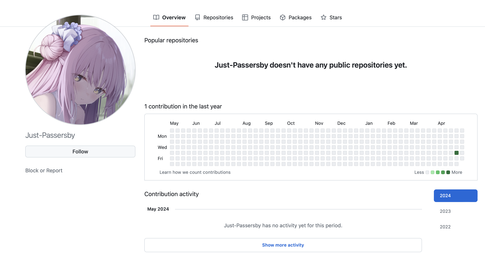

# GitHub介紹

Index:
[toc]

# 什麼是GitHub?
GitHub是一個目前最大的Source Code儲存平台之一，也是目前最大的Git Server，無論是Linux kernel的Source Code還是DOS的Source code都可以在GitHub上找到
2018年被微軟收購，所以目前由微軟營運，被收購後2019年便允許免費帳戶無限制開放Private Repositories
個人主頁：

# 學生專案
如果是在校生（主要看你有沒有`.edu`的mail），可以到[GitHub Education](https://education.github.com/pack)申請學生優惠

# Git與GitHub的關係
Git是版本控制套件，而GitHub則是Source Code儲存平台，但有針對Git做深度優化
