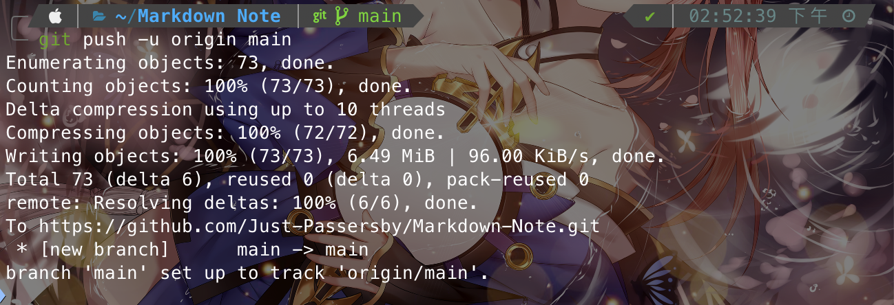

# Git與GitHub協同使用

index:
[toc]

# 建立新專案
如果今天需要新建專案在GitHub頁面的右上角有個`+`號
這時候輸入Repository的名稱不要跟你原本GitHub原有的Repository的撞名，然後使用ASCII所支援的字體
如果你有打算開源你的Source Code，需要注意License的選擇，不同的License在使用上有所區別

當你建立完成後，可以看到像是下圖的引導畫面
版本控制的操作與[透過git控制檔案版本.md](透過git控制檔案版本.md)一致，忘了可以回去看

可以看到無論是new repository還是push an existing repisitory可以看到最後三個步驟都一樣
照著上面指令操作即可，但如果想瞭解他們在幹嘛可以接著往下看

當讓Git控制完成版本後由於此時檔案都還是在本機，所以需要將檔案push到Git Server，首先設定一個伺服器節點
```bash
REMOTE_PATH=https://github.com/Just-Passersby/Markdown-Note.git
git remote add origin $REMOTE_PATH
```
> 說明：裡面的`$REMOTE_PATH`在GitHub提供HTTPS和SSH，哪種傳輸方式差別不大，但注意若使用SSH的格式需要先設定好SSH key

不熟悉這條指令的話，我們逐一分析
首先`remote`參數代表跟遠端的操作有關，`add`指的是新增一個節點，最後的origin是一個「代名詞」，表示後面的GitHub的Repository位置

為和是`origin`？原因這是預設的遠端節點代稱，但這只是大家的共識，如果你今天想要你也可以自己取一個你喜歡的代稱，比如`Idontwant996`就像這樣：
```bash
git remote add Idontwant996 $REMOTE_PATH
```
總而言之，他只是一個遠端節點的代稱
設定完成之後，就可以把東西Push上去了
```bash
git push -u origin master
```


雖然我們只用了`push`一行指令但其實Git做了以下這些事：
1. 把`master`分之的內容推向`origin`這個位置
2. 在`origin`這個節點上，如果`master`不存在，就建立名叫`master`的同名分支
3. 如果節點本身存在`master`分支，則更新該分支
4. 設定upstream，就是`-u`這個參數

如果你的代稱叫做`Idontwant996`，然後你想把分之`freedom`push上去，則同理
```bash
git push Idontwant996 freedom
```

當整個上傳完成後，可以把Repository整理一下，就會變成你Git所管理的內容

這樣就順利把本地專案上傳至遠端了

# 關於upstream
在第一次push的時候，都需要加入`-u`這個參數，表示要設upstream，那什麼是upstream？

單論翻譯，就是「上游」，但只解釋這聽起來很籠統，令人不知所措，這到底是啥？
簡單解釋就是一個分支追蹤的另一個分支。
在Git中，每個分支可以設定一個upstream（但也只能設這唯一一個），他會指向並追蹤某個分支，通常upstream會是Server上的某個分支，但要設定在本地端也行。

如果有設定，他就會把該分之當作預設的upstream，舉例來說：
```bash
git push -u origin master
```
此時會把`origin/master`設為本地`master`分之的upstream。之後執行`git push`而不添加其他參數的時候，Git就會預設你要推往`origin`這個遠端節點，並更新`master`這個節點

也就是說，如果沒有使用`-u`這個參數的話，每一次的push都要說明白
```bash
git push origin master
```
不然Git就會跟你說他不知道要推往哪裡

# 你所不知道的Git分支的命名
前面提到，Push的方式是這樣
```bash
git push origin master
```
其實完整版的指令是下面這樣
```bash
git push origin master:master
```
讓我們用Unix-Like的方式解釋這個東西
```bash
git push origin $LOCAL_FORK:$REMOTE_FORK
```
也就是說冒號前面是本地的分之名稱，後面是Server上的分之名稱，若今天push的時候不希望是`master`而是`Idontwant996`就可以這樣寫：
```bash
git push origin master:Idontwant996
```
這樣在Server建立/更新的分之名稱就不會是`master`，而是`Idontwant996`

# Reference
[為你自己學Git - 十、遠端共同協作 - 使用 GitHub：Git教學：如何 Push 上傳到 GitHub？](https://gitbook.tw/chapters/github/push-to-github#google_vignette)
