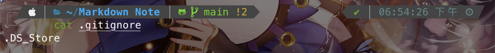

# gitignore

Index:
[toc]

# 不引入的檔案
今天如果你有檔案不希望被Git控制，或者是你發現奇怪的檔案被push上Server，該如何設定？

如果你希望一個檔案不被Git所控制，可以在被Git所控管的根目錄下建立`.gitignore`，然後把不想被控管的檔案名稱（或者路徑）打進去就好
比如說macOS上面的`.DS_Store`，那就直接在裡面打上`DS_Store`就完成了，所有符合條件的檔案都不會被Git控管

那如果說是一開始檔案被隱藏了，結果Push到Server後發現有奇怪的檔案，想把他移掉可以用剛剛所講的方式讓Git不再控管檔案
但如果檔案不適合被移除的話可以參考[Git內的檔案刪除與重新命名](../control/Git內的檔案刪除與重新命名.md)這篇來將其移除Git的控管區

GitHub中建立Repository的時候，也可以在GitHub上設定`.gitignore`

# Local限定：exclude
如果說是單一台機器的或者你就不希望多一個`.gitignore`，可以編輯`.git/info/exclude`這個檔案。但是要注意`.git`的內容是本地的Git設定檔，如果希望clone下來後不需要再設定不被控管的檔案的話，還是建議設定`.gitignore`比較方便。

# Refernce
[GitHub - Ignoring files](https://docs.github.com/en/get-started/getting-started-with-git/ignoring-files)
