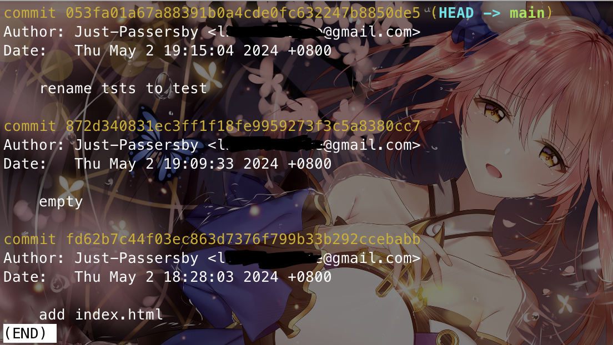

# 查看歷史紀錄

Index:
[toc]

# 檢視目前目前所有commit
當專案被commit之後，你有時候會需要回去看之前各個不同的版本之間不同的紀錄，在Git中，你可以使用以下指令查看目前commit的紀錄
```bash
git log
```
指令執行完後看起來像是這樣：
他紀錄了該目錄所有commit紀錄，commit後面的一串亂碼是SHA1，相當於每個commit的身分證字號
然後Author代表這次commit的人
Date不用說就是發布commit的日期
Date下面有一行字，這就是commit裡面的訊息

隨著commit的次數增加，這種純文字的Commit log不易搜尋與閱讀，此時就可以考慮使用GUI工具協助搜尋與閱讀紀錄，比如SourceTree，或這你會結合GitHub使用也可以push至GitHub後點commit查看紀錄

# 搜尋特定Commit
那有些時候你會需要搜尋特定條件的Commit，你可以參考以下幾種狀況與指令

## 搜尋特定作者
如果想要搜尋特定作者，可以加入`--author="USER"`這個參數，將USER置換成你想找的使用者名稱即可，打起來就會像這樣
```bash
git log --author="USER"
```

## 搜尋特定內文
如果是想尋找特定的commit資訊，可以使用`--grep="text"`這種方式尋找，將text置換成你要找的文字段，加入該參數後的指令如下：
```bash
git log --grep="text"
```

> 補充，以上兩個參數支援regex(正規表示法)

## 搜尋特定時間
如果今天要搜尋特定時間的參數，可以加入以下三個參數搭配使用
- `--since="CLOCK"`
  表示從哪個時刻之後開始搜尋，`CLOCK`自行置換成時間，比如`10am`、`5pm`
- `--until="CLOCK"`
  表示直到哪個時間之前，`CLOCK`自行置換成時間
- `--after="DAYS"`
  代表從哪一天之後，若搭配前面2個參數可以搜尋`DAYS`之後的特定時間段的commit，`DAYS`自行置換為日期，比如`2024-05`

若有GUI工具的話使用GUI工具也可以，甚至可以更加便捷

# Reference
[為你自己學Git - 五、檢視紀錄](https://gitbook.tw/chapters/using-git/log)
