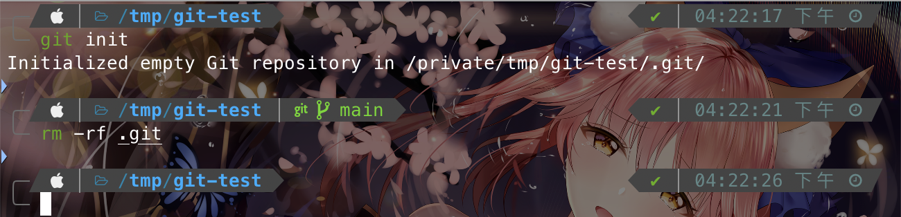
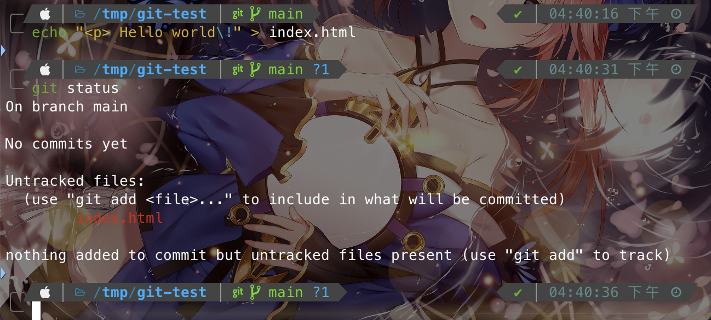
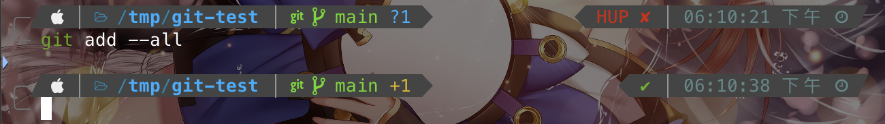
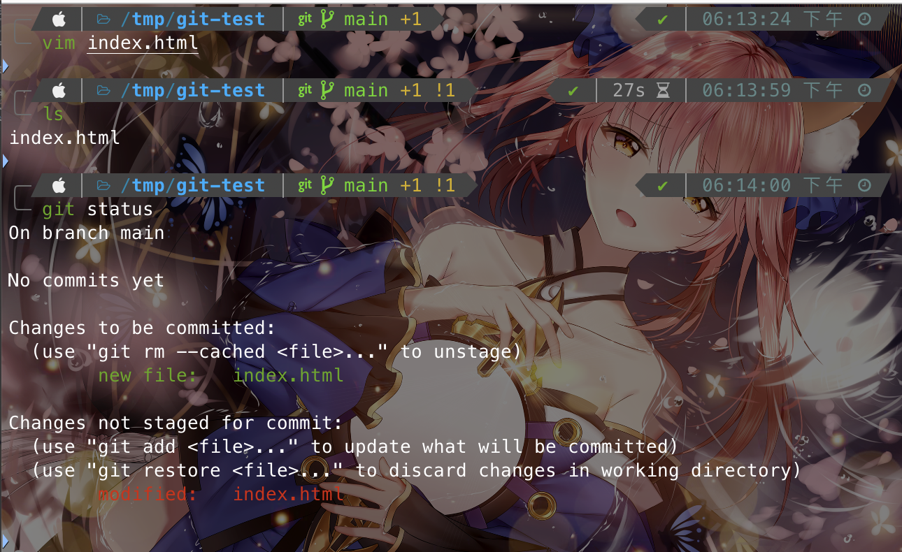
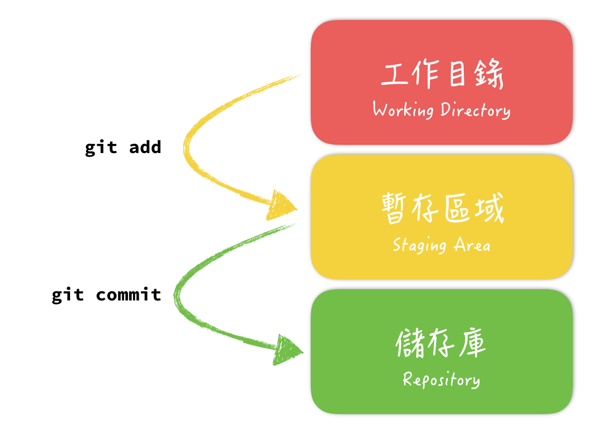

# 透過Git控制檔案版本

Index:
[toc]

# 新增、初始化Repository
如果打算透過全新的目錄去練習Git，可以到`/tmp`(macOS用戶)或者`%temp%`(Windows用戶)練習，因為這個地方是暫存檔的地方，重開機和磁碟清理工具會優先清理這裡
當要交由Git管理的目錄建立完並進入後使用以下指令進行初始化
```bash
git init
```
這樣這個目錄就經由Git進行版本控制了
這個指令呢，主要就是要被控管的目錄中建立`.git`這個目錄，沒有錯，Git就是透過`.git`這個檔案對你的目錄進行版本控制

> Tip: 如果遇到檔案名稱開頭是一個點`.`的，在Unix-Like系統中表示該檔案是隱藏的

如果你希望這個目錄不再被Git控管，只要將`.git`刪除即可
注意，任何檔案在Git的控管下即便被亂刪亂改都還有機會補救，但是若將`.git`刪掉就<span style="color: red">基本沒救</span>了

如果你是用macOS，並且有設定過zsh則可以透過shell確認到該目錄是否有被git控管以及處於哪個版本樹


# 由Git控制檔案
## 檔案狀態
當一個檔案被Git控管後可以透過以下指令來檢測目前檔案在哪個版本樹上
```bash
git status
```
一個剛建立的檔案，輸入令後會是以下輸出
```bash
On branch main

No commits yet

nothing to commit (create/copy files and use "git add" to track)
```
此時這個目錄除了`.git`以外沒有其他檔案

這時我們隨意新增一個檔案後再輸入`git status`來看看

可以看到，我們多了一個untracked的檔案
若使用設定過的zsh，甚至可以看到Git所管理的目錄內，新增了一個未知的檔案，出現一個`?1`
此時也就表示該檔案沒有被git所控管，這時要讓檔案可以被git控制需要將檔案加入Git的暫存區

## 新增檔案至Git暫存區
如果只有要追蹤我們剛剛新增的`index.html`這個檔案，可以使用以下指令加入暫存區
```bash
git add index.html
```
這樣該檔案就交由git託管了，但一般上我們會讓整個目錄都交由Git控管，而且這樣如果之後一個一個加入管理很麻煩，所以我們會使用以下指令來加入Git的暫存區
```bash
git add .
```
或者
```bash
git add -all
```
不過這2個指令還是有不小差距的
在2.0版之後，2者在Git最頂層(以前面範例中是`/tmp/git-test`)的效果都是一樣的，會在暫存區內做以下三件事

- 新增檔案
- 修改檔案
- 刪除檔案

但假如我在`/tmp/git-test`中有個`sub`的目錄，此時我的工作目錄是`/tmp/git-test/sub`裡面的話，那使用`-all`會將整個`git-test`現在的狀態更新至暫存區，而使用`.`則只會更新暫存區內的`git-test/sub`

> 會造成以下這個原因是在Unix-Like中，`.`代表該目錄本身，所以這是造成若不在Git所託管的最上層使用`git add .`只會更新你所在的工作目錄

此時如果你是使用設定過的zsh在add完後你的`?1`會變成`+1`

## 特殊狀況：add完成後又修改了檔案
若你add完成後又修改了檔案，這時如果直接commit會有問題
原因是此時你還沒將你修改玩的檔案更新至暫存區，而且使用經過設定的zsh也可以看到異樣
看到那個`!1`了嗎？也就就是說此時有檔案異動了，若這時直接commit的話那Git此時是紀錄修改前的狀態，所以只在確定完成修改後要commit之前，請都先將檔案add上次在執行commit的動作

## 儲存異動
若整個修改都完成後，add只是加入暫存區，但是要經過commit才能將這個異動記錄下來並儲存，commit的指令很簡單，指令如下

```bash
git commit -m "Messenge"
```
注意裡面的`Mesenge`必須好好寫，因為這個在多人協作說是用來說明你修改了哪些東西、功能為何的地方
此時commit完成後，Git便會將這份異動記錄下來變成一個版本

## Commit需要注意的地方
如同前面所說，Commit只會紀錄經過add後加入暫存區的東西，所有在修改玩後裡面的內容要確立成一個版本，記得都要先add
commit的同時會將說明這次版本異動了什麼，因此特別是在多人協作專案時注意以下準則
- 不要使用過於情緒性的字眼等避免不必要的問題
- 不要再在commit messenge裡面只留個"bug fixed"這種模糊的描述
- Commit messenge盡量簡潔、明瞭

# 署理個區域的關係
大致上，各個區域的關係像下面這張圖

要正式進入儲存區才能算是紀錄一個版本

# Reference
[為你自己學Git - 五、開始使用Git：新增、初始 Repository](https://gitbook.tw/chapters/using-git/init-repository)
[為你自己學Git - 五、開始使用Git：把檔案交給 Git 控管](https://gitbook.tw/chapters/using-git/add-to-git#google_vignette)
[為你自己學Git - 五、工作區、暫存區與儲存庫](https://gitbook.tw/chapters/using-git/working-staging-and-repository)
