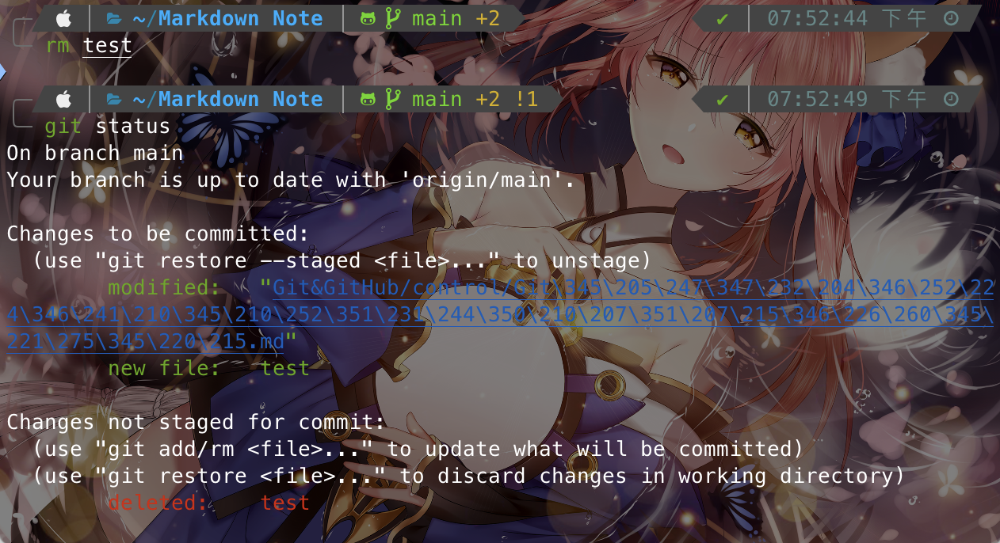

# Git內的檔案刪除與重新命名

Index:
[toc]

# 刪除檔案
如果這個檔案確定要刪除不需存在與控管直接刪除即可，刪除後可以觀察此時的Git status（注意下面的檔案）: 
確定要這麼做以後使用`git add`就可以完成這次的修改

但其實這樣可以合併成一個步驟，那就是以下這個指令：
```bash
git rm FILE
```
此時這個檔案就會直接被刪掉並加入到暫存區

但是這些方式都會把檔案給真的刪掉，如果只希望Git不再控管該檔案可以怎麼做？
可以透過加入`--cached`這個餐著樣黨案就不會真的被刪掉，而是只是被移出Git的暫存區
```bash
git rm FILE --cached
```
此時檔案就會被移出Git的暫存區，可以看一下檔案狀態
由於這個檔案在我的`.gitigonre`裡面，所以被移除後他會看不到這個檔案，只有呈現`deleted`的狀態，如果該檔案沒有被exclude或是ignore則同時還會有`Untrack`

> 如果想要知道讓Git不再控管哪些檔案，可以參考[gitignore](../basic/gitignore.md)這個文章

# 重新命名
直接重新命名可以了
```bash
mv OLD_NAME NEW_NAME
```
不過這樣對於Git來說這是刪除一個檔案同時新增一個檔案，對於Git而言是2個操作，需要重新add回暫存區

如果你只要要重新命名一個檔案可以透過Git直接操作：
```bash
git mv OLD_NAME NEW_NAME
```
此時這個檔案對於Git而言就是重新命名了，有個`renamed`的Tag

# 補充
對於Git而言，其實他們不在乎檔案名稱，只在乎檔案內容，檔案的SHA-1也是透過內容算的。但是重新命名的時候，對於Git而言這是新的物件從而還沒指向，需要重新加入到暫存區，這一部分涉及的是`.git`內的操作。

# Refernce
[為你自己學Git - 五、【狀況題】如何在 Git 裡刪除檔案或變更檔名？](https://gitbook.tw/chapters/using-git/rename-and-delete-file)
