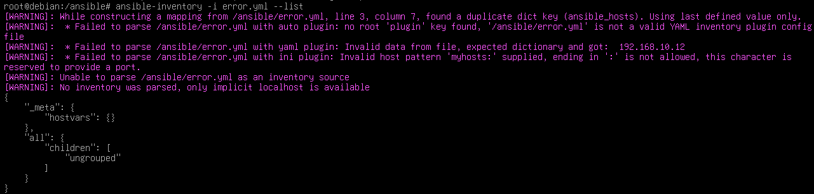
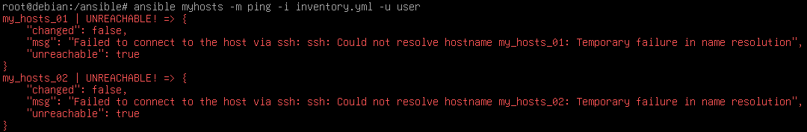

# Inventory設定

Ansible支持2種格式來編寫Inventory：ini和YAML

2種寫法參考：
- ini:
```ini
[myhosts]
192.168.10.11
192.168.10.12
```

- YAML:
```YAML
myhosts:
    hosts:
        my_hosts_01:
            ansbile_hosts: 192.168.10.11
        my_hosts_02:
            ansbile_hosts: 192.168.10.12
```

`myhosts`指的是群組名稱
寫完之後就可以使用`ansible-inventory -i inventory.ini --list`來驗證inventory是否正確，如果不正確會像是下面這圖：

如果Inventory設定正確SSH也設定完成就可以使用以下指令測試inventory以及與伺服器的連線：
```bash
ansible myhosts -m ping -i inventory.ini
```

如果要指定登入的使用者可以透過增加`-u USERNAME`來替換成指定使用者

# Simple ini to YAML
如果你直接照著官方的文檔寫應該會寫出像我上面這種YAML的inventory，然後使用`ansible-inventory`測試也會過，直到使用ansible ping你就會發現

這種問題，除了透過設定DNS或者修改`hosts`文件來讓Ansible可以解析之外，你也可以先用ini格式寫好主機和分配Group，然後再用剛剛驗證inventory的指令轉換成YAML格式

你說怎轉換？加個`-y`就好，像這樣：
```bash
ansible-inventory -i inventory.ini --list -y > inventory.ini.yml
```

檔案內容如下：
```YAML
all:
    children:
        myhosts:
            hosts:
                192.168.10.11: {}
                192.168.10.12: {}
        ungrouped: {}
```

可以將其瘦身為以下內容：
```YAML
myhosts:
    hosts:
        192.168.10.11: {}
        192.168.10.12: {}
```

透過`ansible-inventory -i inventory.ini.yml --list`檢查是能通過的

## Why YAML
YAML是Ansible主要使用的格式，除了後面的Playbook以外，在inventory上，設定port，指定登入使用者等功能也是需要透過YAML格式編寫來實現的，比如以下指定使用者：
```YAML
myhosts:
    hosts:
        192.168.10.11: {}
        192.168.10.12: {}
    vars:
        ansible_user: user
```
因此才會不只介紹如何使用YAML寫，以及如何從ini跳轉到YAML
