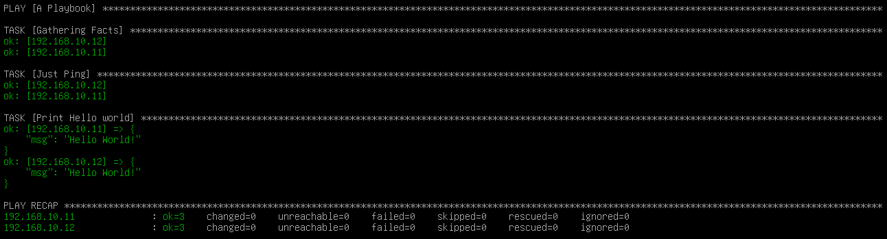

# Playbook 編寫
Ansible真正用來控制與管理機器的東西來了，就是Playbook

Playbook可以分為以下3個部份：
1. Play
2. Task
3. Module

以下是參考官方寫出來的Playbook:
```YAML
- name: It is Playbook      # Play
  hosts: myhosts
  task:                     # Task    
   - name: Ping hosts
     ansible.builtin.ping:  # Module

   - name: Print message
     ansible.builtin.debug: # Module
       msg: Hello world!
```

Module看起來有點長阿，主要是因為它包含了宣告是Ansible內建模組的`ansuble.builtin`，但這串是可以刪掉的，所以調會變成如下：
```YAML
- name: It is Playbook      # Play
  hosts: myhosts
  task:                     # Task    
   - name: Ping hosts
     ping:                  # Module

   - name: Print message
     debug:                 # Module
       msg: Hello world!
```
運行Ansible Playbook的指令為`ansible-playbook -i inventory.ini playbook.yml`

這上述兩種寫法都是可以運作的，執行成功的畫面如下：

就此可以算是真正的開始使用Ansible!

# Reference
[Ansible Getting started - Creating a playbook](https://docs.ansible.com/ansible/latest/getting_started/get_started_playbook.html)
[Lin Cheng-Chieh HackMD - 學習 Ansible](https://hackmd.io/@blueskyson/learn-ansible)