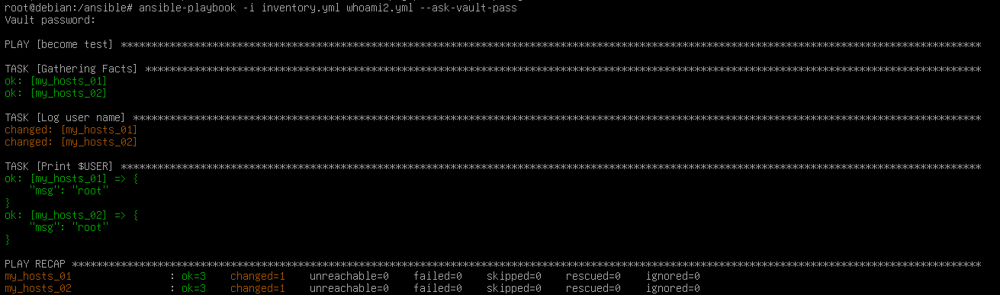

# become提權
在Ansible中，十分仰賴`become`這個指令與Plugins來進行提權操作

[toc]

# become指令
- `--become`，`-b`
  執行Playbook連線到機器後會提權（不會詢問密碼）

- `--ask-become-pass`，`-K`
  設定提權密碼

- `-become-method=METHOD`
  設定提權方式（default = sudo），option: sudo | su | pbrun | pfexec | doas | dzdo | ksu | runas | machinectl

- `-become-user=USER`
  設定提權後的使用者（default=root）
  須搭配`-b`使用，本身只設定若有提權會改為什麼使用者

# become plugins
Ansible在Playbook中也可以用become，他有內建的become plugins，具體怎麼用？

## 分區塊
首先，Ansible在使用become時，下的位置不同，會有不同效果，詳細可以看看[Playbook編寫](Playbook編寫.md)，這裡就直奔重點。

反正你可以這麽理解：從Play到Tasks都可以使用，只是引想的範圍大小而已。

## YAML寫法
### become 指令
become可以在Ansible Playbook下面的Play和Task層級運作

以下是become的指令寫法，以下指令所做的事情互不干涉（比如使用become_user並不會讓become自動變為yes）：
- 使用become：`become: yes|true`
- 變更提權方法：`become_method: [method]`，可用參數同[become指令](#become指令)
- 提權指令參數：`become_flags: [option]`，例如搭配`su`指定登入後的Shell或環境變數，比如`"-s /bin/bash"`
- 更改提權後的使用者身份：`become_user: [username]`，它只更改提權後的使用者身份，而不是登入身份。若沒使用，預設指定`root`

### become 連接變數（Become connection variables）
可在Play和Task層級用`vars`設定，如果需要透過外部的YAML檔案來引入become相關參數，就需要使用連接變數，如果你要使用外部vars的YAML檔或者用變數覆蓋原本的become設定，你可以簡單理解為在相應功能在`vars`添加並加入prefix `ansible_`以設定
- `ansible_become`: 覆蓋`become`的設定決定是否提權（Tasks的優先權比Play的優先權高）
- `ansible_become_user`: 連接變數版的`become_user`，優先級同`ansible_become`
- `ansible_become_flags`: 官方文獻無寫，但若需要透過外部引入也是透過增加`ansible_`在前面
- `ansible_become_method`: 應當使用哪種become方法(confuse，484跟`become_methods`同質性太高？)
- `ansible_become_password`:設定become password，可以代替掉輸入`-K`，把密碼加密的方法參考[下節](#在playbook中設定become-password)
- `ansible_common_remote_group`: `setflac`和`chown`都失敗，建立一個臨時檔案並使用`chgrp`到另一個群組。可參考[官方文獻](https://docs.ansible.com/ansible/latest/playbook_guide/playbooks_privilege_escalation.html#risks-of-becoming-an-unprivileged-user)獲得更多資訊

### 在Playbook中增加become的安全性與可維護行
Ansible用來加密YAML檔案的指令：`ansible-vault`

Ansible雖然支持使用剛剛提到的`ansible_become_password`設定become password，但如果直接寫在上面會有相當嚴重的資安問題，所以真的要這麽做最好將這項參數加密。

官方的文獻可以參考[Using encrypted variables and files](https://docs.ansible.com/ansible/latest/vault_guide/vault_using_encrypted_content.html#playbooks-vault)，我結合ChatGPT和Grok 3後整理成如下：

Playbook可以在Play裡面使用`vars_flie`或者在Task使用`include_vars`，由於研究過程發現這兩者以及加密有不少應用，所以新建一個[Ansible變數](./Ansible變數.md)來紀律與解釋，這裡不展開

你知道Playbook可以引入外部的變數YAML檔案後，先來了解如何寫這些YAML變數。首先，你如果要把become透過變數的方式來設定，需要使用[在Playbook中增加become的安全性與可維護行](#在Playbook中增加become的安全性與可維護行)內所提的方法設定，寫在外部YAML檔案時可以像以下這樣寫：
```YAML
# su_root_vars.yml
ansible_become: true
ansible_become_method: su
ansible_become_flags: "-"
ansible_become_password: P@ssw0rd
```
當然，你除了直接建立YAML的檔案存放變數，既然都說要提昇安全性，我們可以使用`ansible-vault create VARS_FILE.yml`來建立並把剛剛寫的參數打進去，用這種方法建立的檔案會透過AES-256加密，所以務必紀錄好你的加密密碼。

建立完成後，我們就可以在Playbook透過`vars_file`和`include_vars`來引入到Playbook裡面，兩者的應用與具體區別我放到[Ansible變數](./Ansible變數.md)，這裡不展開，直接放範例：
```YAML
- name: become test
  hosts: myhosts
  vars_files:
  - su_root_vault.yml
  tasks:
  - name: Log user name
    command: whoami
    register: result

  - name: Print username
    debug:
      msg: "{{ result.stdout }}"
```

接著你就可以使用`ansible-playbook -i inventory.yml PLAYBOOK.yml`做測試了，如果你有用`ansible-vault`編寫變數檔，記得加入`--ask-vault-pass`參數，變成`ansible-playbook -i inventory.yml PLAYBOOK.yml --ask-vault-pass`，上面的Playbook執行完應該結果會類似下面這樣：

如果我用Vault的話不是還要輸入密碼？那這樣為何不直接用`-K`就好？如果你每個伺服器的become Password甚至User都不一樣，那這種可以根據Host的決定使用不同的變數檔，並且變數檔可以使用統一的密碼甚至是密碼檔來管理，進而簡化CI/CD的部屬（By Grok 3）

# Reference
(Ansible Docs:Understanding privilege escalation: become)[https://docs.ansible.com/ansible/latest/playbook_guide/playbooks_privilege_escalation.html]
(Ansible Docs:Become plugins)[https://docs.ansible.com/ansible/latest/plugins/become.html#become-plugins]
