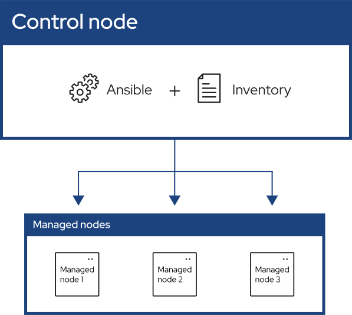

# 運作原理與方式

這是你點開Ansible Docs的[Getting started](https://docs.ansible.com/ansible/latest/getting_started/index.html)頁面會看到的第一張圖：

可以這麽理解Ansible的運作機制：
- Control node:
 裝有Ansible的Linux主機可以透過Ansible並配上內含需要控制的主機的清單(Inventory，我會翻譯為主機清單)

- Managed nodes:
 被指定用Ansible控制的主機

## 控制方法
Ansible會透過各種不同的模組來完成不同的任務，如果多種不同的任務、甚至主機群寫成一個控制腳本在Ansible被稱為Playbook(劇本)，每個Playbook會有多個Task(任務)，然後不同的Task會使用對應的模組(moduel)

當Playbook寫完之後就可以用控制Inventory內指定的nodes進行Playbook內指定的內容，既然是遠端操作那就代表有用遠端連線的協定，Ansible使用的是SSH，因此不用像是Chef之類的每個被控制的機器要安裝額外的連線套件專門用於自動化管理

# 安裝方法
（官方）首選pip：
```bash
pip install ansible
```

Debian/Ubuntu官方庫：
```bash
apt install ansible
```

# Refence
[Getting started with Ansible](https://docs.ansible.com/ansible/latest/getting_started/index.html)
[現代 IT 人一定要知道的 Ansible 自動化組態技巧 - 怎麼操作 Ansible？](https://chusiang.gitbooks.io/automate-with-ansible/content/06.how-to-use-the-ansible.html)
