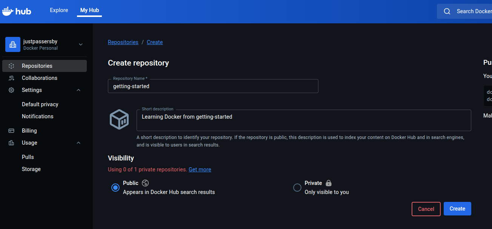

# 分享映像
基本上，要分享映像，除了直接上傳到GitHub (會吃調儲存配額)，就是上傳到Docker Hub

這篇以上傳到Dokcer Hub為主，所以要先去Docker Hub做登入，沒帳號就去申請

# 建立儲存庫
要Push image上去，你要先在Docker Hub建立儲存庫
1. 登入Docker Hub
2. 在個人的Repositories頁面往下拉，找到Respoitories的欄位，按Create a repositoiry
3. 命名成你要的名字，接續官方教程的話使用`getting-started`。Visibility選Public
4. 按Create

# 上傳(Push)映像
原則上，Docker image要Push到Docker Hub上該image路徑需要符合`DOCKER_ID/IMAGE_NAME[:Tag]`這個格式，所以

1. 在Docker engine上登入你的Docker: `docker login`，應該會有類似以下資訊
 ```
 USING WEB-BASED LOGIN
 
 i Info → To sign in with credentials on the command line, use 'docker login -u <username>'
          
 
 Your one-time device confirmation code is: ****-****
 Press ENTER to open your browser or submit your device code here: https://login.docker.com/activate
 
 Waiting for authentication in the browser…
 
 WARNING! Your credentials are stored unencrypted in '/home/user/.docker/config.json'.
 Configure a credential helper to remove this warning. See
 https://docs.docker.com/go/credential-store/
 
 Login Succeeded
 ```
 這時候你去你的Docker Hub的Settings內點到Personal access tokens欄位，應該會看到一個自動生成的Token: 
 > 官方教學指令：`docker login YOUR_DOCKER_ID`
 
 如果不登入會顯示這個錯誤：
```
...

denied: requested access to the resource is denied
```

2. 確認登入後你可以用`docker image ls`來確認你要Push的image
3. 使用`docker tag`來替你的docker標注使用者名稱，如果tag欄位不標注預設會自動使用latest，以`getting-started`為例
```bash
docker tag getting-started YOUR-USER-NAME/getting-started
```
 這時候你就可以再用`docker image ls`驗證看看否打上Docker ID和你要的Tag(如果有指定)

4. 這時候你就可以用`docker push YOUR-USER-NAME/getting-started`把image push上去了

# 使用Tag過得Image執行Docker
其實指令差不多，只是要增加Docker ID的欄位

但是須注意的是，如果Docker image需要在不同平台(比如x86_64和ARM)上執行需要執行`docker build`並使用`--platform`參數，有相關需求請參閱[這篇](https://docs.docker.com/build/building/multi-platform/)

# Reference
[Docker Docs - Share the application](https://docs.docker.com/get-started/workshop/04_sharing_app/)