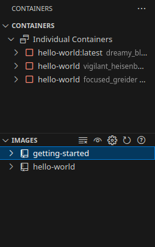
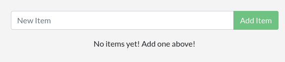
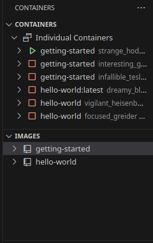

# 容器化應用程式
Docker官方有提供基於Node.js寫出服務的示範用容器，只要有以下東西就能實做：
- 最新版Docker Engine
- Git
- VS Code or other Text Editor

我推薦使用VS Code，除了有Highlight以外，VS Code可以安裝[Remote Development](https://marketplace.visualstudio.com/items?itemName=ms-vscode-remote.vscode-remote-extensionpack)擴充後對Docker和運行的Container進行更方便與直接的管理，比Docker Desktop好用

Docker示範用的Container公佈在GitHub，很小，直接pull下來就能用
```bash
git clone https://github.com/docker/getting-started-app.git
```
整個目錄內容應該會像這樣
```bash
docker_zone/getting-started-app/
├── .dockerignore
├── .git
├── package.json
├── README.md
├── spec
├── src
└── yarn.lock
```
> `tree`參數：-aL 1

## 建立app映像
Docker建立映像的方法就是寫一個`dockerfile`(這就是檔名)，這個是最基本的操作，每個Docker專案都會需要這麽做。官方的例子需要在`dockerfie`裡面寫下這些東西：
```dockerfile
# syntax=docker/dockerfile:1

FROM node:lts-alpine            
WORKDIR /app
COPY . .
RUN yarn install --production
CMD ["node", "src/index.js"]
EXPOSE 3000
```
這個`dockerfile`以`node:lts-alpine`作為基礎映像，該映像預裝了Yarn包管理工具和Node.js，並複製`dockerfile`內指定的原始碼以及安裝必要的依賴項，最後啟動程式。

要建立映像之前，先`cd`到`getting-started-app`目錄裡面，然後輸入以下指令：
```bash
docker build -t getting-started .
```
執行指令後，首先會根據`FROM`來看你需要什麼基礎映像，如果電腦沒有就會下載。

安裝完映像後根據`RUN`執行image複製完後的操作，並且根據`CMD`參數寫好image開啟後預設執行的指令。

剩下的參數，`-t`是設定image的名稱，最後的`.`則是`dockerfile`的位置在哪個目錄。

以VS Code為例，你可以看到建立完後的樣子：


## 執行程式容器
有了映像就能啟動容器，啟動容器的指令如下：
```bash
docker run -d -p [HOST_IP:HOST_PORT:CONTAINER_PORT] [IMAGE_NAME]
```
在Docs的實例中把`[HOST_IP:HOST_PORT:CONTAINER_PORT]`和`[IMAGE_NAME]`改成`127.0.0.1:3000:3000`和`getting-started`

`-d`(`--detach`)參數可以讓Container放到背景執行，不會在輸入指令後佔用終端機輸出log。

`-p`(`--publish`)可以指定Container要把服務Mapping到指定的主機IP位址和Port，格式就是`[HOST_IP:HOST_PORT:CONTAINER_PORT]`，如果要發布到loopback界面，除了位址指定`127.0.0.1`以外，`localhost`也可以。如果沒有使用這個參數，外部網路無法訪問Container的服務。

接下來你就可以試試看在瀏覽器輸入`http://localhost:3000/`可不可以訪問服務，如果你的界面長這樣，代表成功運行

接著你可以在網頁上面輸入與新增東西看看，測試你與Container的交互

如果你想確認你前正在執行哪些容器，可以使用`docker ps`來顯示，輸出繪像下面這樣：
```bash
CONTAINER ID   IMAGE             COMMAND                   CREATED         STATUS         PORTS                      NAMES
b4a5eec1666e   getting-started   "docker-entrypoint.s…"   4 minutes ago   Up 4 minutes   127.0.0.1:3000->3000/tcp   strange_hodgkin
```
或者是在Docker Desktop或裝有[Docker](https://marketplace.visualstudio.com/items?itemName=ms-azuretools.vscode-docker)等擴充的VS Code可以查看你正在執行的Container:


## 同場加映
VS Code的Docker擴充除了可以像Docker Desktop這樣看到目前建立的容器，你還可以對容器右鍵，進行管理，包括關閉、重起容器，甚至可以使用`Attach Shell`即可使用Container的Shell甚至是`Attach Visual  Studio Code`建立新的VS Code視窗，管理Docker的檔案和操作Shell

# Reference
[Docker Docs - Containerize an application](https://docs.docker.com/get-started/workshop/02_our_app/)