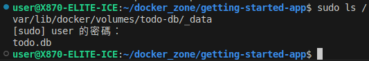

# 持久化資料庫
Docker透過指令啟動Container時，其實都是基於image和下達的參數去建立一份Container來執行，這種情況會造成一個問題：每次執行Container時資料或資料庫不一致。

那這種問題如何解決？

1. 透過VS Code安裝Container Extension後點開管理Container的界面來開啟被關閉的Container。
2. 設定共享檔案，將資料掛載在主機的FS上面，並且每次透過指令執行Container時掛載對應的目錄/FS。

## 實際範例
這個實例將證明Container運行時是直接複製image並運行Container且Containers互相不共用File System。

範例使用的是運行Alpine的容器：
1. 第一個容器建立`greeting.txt`
   ```bash
   docker run --rm alpine touch greeting.txt
   ```
   > 在image名稱(這次範例是`alpine`)後面輸入的任何參數會被作為容器執行的會執行的指令，且執行完成後Container會馬上關閉。
2. 第二個容器則是查看檔案是否存在：
   ```bash
   docker run --rm alpine stat greeting.txt
   ```
然後你應該會得到以下資訊：
```
stat: can't stat 'greeting.txt': No such file or directory
```

# Container Volumes
以getting-started這個image為例，to-do list的紀錄是使用SQLite儲存在`/etc/todos/todo.db`內，以SQLite來說它會直接把整個資料庫寫在一個`*.db`或`*.sqlite`檔上，所以只要能夠讓整個Database在不同Container內共用就能實現資料的傳輸。

那這裡使用的方法是讓Container啟動時掛載一個Volumes (資料卷/資料磁區)，並把Database寫在Volume裡面，這樣重新開啟其他容器直接掛載該Volume即可實現資料在多個Container內共用。

## 建立Volumes和啟動Container掛載
1. 建立資料卷
   ```bash
   docker volume create [VOLUME_NAME]
   ```
2. 如果要讓容器掛載Volumes，先將Container stop
3. 重新啟動Container，但是增加掛載資料卷的參數
   ```bash
   docker run -dp $HOST_IP:$HOST_PORT:$CONTAINER_PORT --mount type=volume,src=$VOLUME_NAME,target=$CONTAINER_MOUNT_PATH $IMAGE_NAME
   ```

那以getting-started為例，`$HOST_IP:$HOST_PORT:$CONTAINER_PORT`和`$IMAGE_NAME`改成`127.0.0.1:3000:3000`和`getting-started`，`src`指定為`todo-db`，target指定為`/etc/todos`。

# 驗證Database共用
1. 透過上面的參數啟動一個Container後，隨便建立一些to-do項目
2. 建立完to-do後關閉甚至把Container刪除。
3. 使用一模一樣的指令和參數重新開啟Container
4. 刷新web page看一下，如果還在就是成功！

額外項目：你可以在`--mount`使用和不使用的2種情況下互相切換來看看to-do list會不會被保留

# 滲入探討Volumes
既然建立了docker volumes可以讓不同Container共用同一個Volumes，那說明該Volumes必定會被儲存在硬碟某處，使用`docker volume inspect`可以檢查volumes的資訊：
```bash
docker volume inspect $VOLUMES_NAME
```
以getting-started為例，把`$VOLUMESA_NAME`改為`todo-db`後，你應該會得到類似以下的資訊：
```json
[
    {
        "CreatedAt": "2025-11-09T19:37:19+08:00",
        "Driver": "local",
        "Labels": null,
        "Mountpoint": "/var/lib/docker/volumes/todo-db/_data",
        "Name": "todo-db",
        "Options": null,
        "Scope": "local"
    }
]
```
`Mountpoint`就是實際Volumes在本地的路徑，你可以直接查看，但是你需要root權限才可以訪問。

實做檢查：


# Reference
[Docker Docs - Use bind mounts](https://docs.docker.com/get-started/workshop/06_bind_mounts/)
