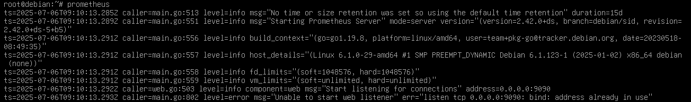

# 安裝與介紹

[toc]

# Prometheus介紹
開源的監控與警報工具包，繼Kubernetes之後第二個加入[CNCF](https://datadrivenai.wordpress.com/2019/11/06/%E4%BB%80%E9%BA%BC%E6%98%AF-cncf%EF%BC%9F%E5%8F%8A%E5%85%B6%E5%B8%B6%E4%BE%86%E5%B0%8D-cloud-native-%E7%A4%BE%E7%BE%A4%E7%9A%84%E5%BD%B1%E9%9F%BF/)計畫的項目，所以對純雲環境也很適合

Prometheus蒐集的是指標(metrics)與時間序列對的資料（比如Web server的請求時間，或者是Database的活動咧街與查詢等，也可以是CPU、RAM等硬體的使用率），以及可選用稱為標籤的key-value pairs.

Prometheus官方提供的架構圖:

## Prometheus適合的場景
純數字數據蒐集，若是監控微服務也很適合甚至可以監控多微度資料，對多微度資料進行蒐集與查詢

高可靠性，可以在基建受損的情況下繼續蒐集資料，排查問題，並且每個Prometheus都是獨立的，不依賴網路儲存與其他遠端服務。

## Prometheus不適合的場景
講求精準性的資料，比如需要per-request billing（諸如API調用次數、Database查詢次數等）的場景需要其他監控軟體的搭配。

# 安裝Prometheus 
## APT
一如既往的先更新APT
```bash
apt update && apt upgrade -y

# if update error, excute command：
apt full-upgrade
```
更新完後就可以安裝Prometheus：
```bash
apt install prometheus -y
```
輸入`prometheus`可以啟動，以下是APT裝於啟動後得到的資訊，看起來安裝完成後預設開機自啟，綁定全網卡IP，port為9090：

如果輸入`http://prometheus.server:9090/metrics`則可以看到目前Prometheus目前提供的指標

直接進入`http://prometheus.server:9090`後你應該會看到簡單的UI，在Expression內輸入`prometheus_target_interval_length_seconds`可以測試Prometheus的輸出，這個是查詢Prometheus的目標狀態查詢時間間隔。

另外Prometheus還會需要搭配Node-exporter使用，透過APT安裝的方法它會一併把Node-exporter安裝好，並且把相關設定一同寫進`/etc/prometheus/prometheus.yml`，預設是開放`http://prometheus.server:9100`，可以透過瀏覽器訪問

如果想額外開放其他Node-exporter在其他Port上面，可以使用以下指令開啟：
```bash
prometheus --web.listen-address IP:Port &
```
`&`是用於讓該指令放置於後台執行，避免終端被佔用
> 需要注意雖然設定裡面使用`localhost`作為IP address，但在Debian的終端機中如果用`127.0.0.1`或`localhost`，那新的Node-export只會開放在loopback界面上。
如果你是想開放在任意界面上都能訪問，請是用`0.0.0.0`

> 如果你想把你自己新開的Node-exporter給關閉，可以用`ss -tulpn`找到你想關掉的，看後面他的pid，使用`kill`將其關閉

若要重起Prometheus，你可以使用官方提供的`kill SIGHUP <Prometheus_PID>`，透過APT安裝的也可以使用`systemctl restart prometheus`來重起

## Offcial website
一如既往的先更新APT
```bash
apt update && apt upgrade -y

# if update error, excute command：
apt full-upgrade
```
更新完後使用`wget`獲取安裝檔，以(7/8的)最新版3.4.2為例：
```bash
wget https://github.com/prometheus/prometheus/releases/download/v3.4.2/prometheus-3.4.2.linux-amd64.tar.gz
```
完成後使用以下指令解壓縮並進入目錄:
```bash
tar xvfz prometheus-*.tar.gz
cd prometheus-*
```


# Reference
[(HackMD) 雙倍奇多 - 普羅米修斯Prometheus監控](https://hackmd.io/@cheese-owner/BkF8Kmlc5)
[Prometheus - Getting started](https://prometheus.io/docs/prometheus/latest/getting_started/)
