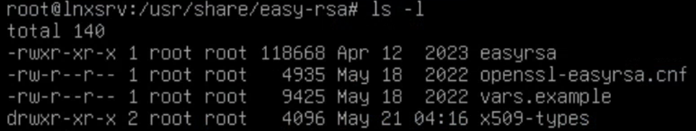
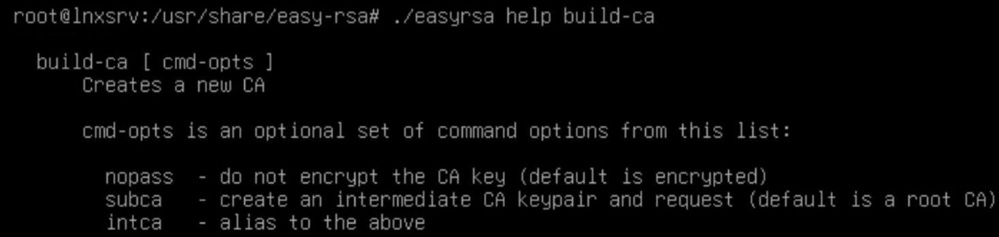

# Easy RSA初始化與環境說明

Index:
[toc]

# Easy RSA目錄
如果你是Debian/Ubuntu體系使用`apt`安裝，Easy RSA的東西預設會在`/usr/share/easy-rsa`裡面(沒有任何指令被新增在`$PATH` ˊ>`)

好勒，進到Easy RSA目錄下你會發現底下就這4樣東西，沒有其他的
放心，你沒少裝東西，Easy RSA就這些東西而已，讓我告訴你這些東西接下來怎麼用
- `easyrsa`: 整個Easy RSA最重要的東西，Easy RSA的所有操作都靠它
- `openssl-easyrsa.cnf`: 使用OpenSSL style的Easy RSA設定文件，預設選項與細節設定都在這邊設（順帶一提OpenSSL也可以手搓CA）
- `vars.example`: Easy RSA也可以透過設定屬於自身的環境變數來設定，裡面提供了設定Easy RSA環境變數的參數與說明
- `x509-types`: 裡面存放各種簽發憑證設定的設定，後面會詳細說明

由於Easy RSA沒有相關指令被丟到環境變數中，所以你需要`/usr/share/easyrsa`或者`cd`進去後再用`./easyrsa`進行操作

# Easy RSA command line tools
使用以下指令可以取得Easy RSA指令工具的使用說明
```bash
./easyrsa help

# same effect
./easyrsa
```
當然你也可以在`help`後面接上你要查詢的功能，會有更詳細的說明，比如:
如果有`[ cmd-opts ]`的功能，也會附上可以用的參數

如果你本身有PKI的基礎加上看得懂裡面的英文的話，即使沒用過也是能夠迅速上手並達成基本操作的

麻...當然我們還是瞭解Easy RSA實際上如何使用指令工具比較好，也比較好瞭解Easy RSA是如何運作的

## 初始化與指定CA類型
Easy RSA在使用的第一步是要先初始化PKI，使用以下指令初始化
```bash
./easyrsa init-pki
```
後續如果你想把你現在的CA刷掉也是透過這個指令實現

初始化完成後可以看到`easy-rsa`的目錄底下多了`pki`這個目錄，除了真正的CA設定檔，還多了2個目錄:
- `reqs`: 用於存放向Easy RSA申請的憑證
- `private`: 存放Easy RSA簽出來的私鑰

前者在後面的操作會重要，後者則是要注意保護，避免洩漏

好勒，初始化完成後，就可以來正式的建立CA(剛剛只是初始化)
```bash
./easyrsa build-ca
```
如果你是要建立中繼CA的話要加入`subca`這個參數在`build-ca`後面
過程中會要你設定密碼，再來設定Common Name，這個就是你打開憑證時會顯示的名稱

這樣你的CA就設定完成，接下來就可以來簽署憑證了

## 為什麼要把初始化與建構CA分開？
主要是過程中如果把這兩個步驟分開來後可以細化操作與設定
首先是`init-pki`，它提供了不同選項來決定要讓新的CA沿用舊的設定還是使用全新的設定

再來是建構CA的部分，眾所皆知CA也被分為最頂層的Root CA和中間的中繼CA，所以這個過程就然就需要其他參數設定

你說什麼情況會需要一直換不同的CA?

比如我在異地CA離線需要現場自簽憑證，或者是不同平台簽出來的憑證某些套件用不了
在不同平台與套件上CA所簽出來的憑證會有細微的差別，這種差別有可能發生相容性問題（在OpenVPN上遇過:< ），所以有時候可能會需要臨時搭一個不同平台的CA來完成憑證的簽發，甚至同一個機器同時替多個CA代簽