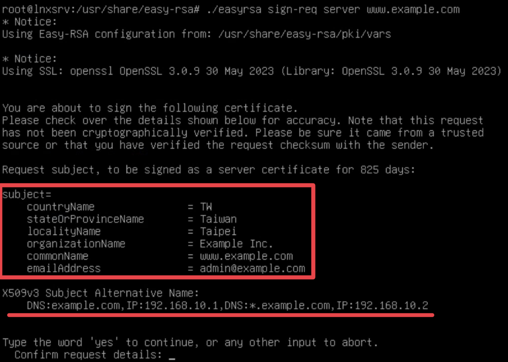

# 憑證簽發與管理

Index:
[toc]

# 導入申請
當我們收到CSR之後我們要怎麼導入到Easy RSA?
當然還是使用我們的`./easyrsa`指令工具，使用以下指令可以將CSR導入Easy RSA
```bash
./easyrsa import-req $CSR_FILE_PATH $REQUEST_NAME
```
需要注意的是`$REQUEST_NAME`的輸入會引響Easy RSA對於這個CSR的識別，可以從這個例子參考
可以看到`$REQUEST_NAME\.req`會被新增到`pki/reqs`

# 簽署憑證
當你把憑證導入進來後你就可以在你想要的時候簽署憑證了，不廢話，使用以下指令簽署
```bash
./easyrsa sign-req $CERT_TYPE $REQUEST_NAME
```
常見的`$CERT_TYPE`:
- `server`: 用於TLS傳輸
- `client`: 需要Client驗證的場景，比如VPN
- `ca`: 簽發中繼CA的憑證

在簽署時，可以看到憑證申請資訊（用紅圈標注）和SAN（紅色底線），如果無誤輸入yes就可以簽署了

簽署完成後會根據設定、申請資訊產出憑證，注意圈起來的資訊是否正確，如果正確就簽署完成了，不符預期就重簽或者確認CSR資訊
阿紅色底線就是簽發出來的憑證存放的位置，把這張憑證丟給申請憑證的人就完成了

Wait，什麼是`$CERT_TYPE`，憑證具體有哪些類型？

## WTF is x509-types
以下為理論補充，要看實作請自行跳到[撤銷憑證](#撤銷憑證)繼續實作，

還記得前一章的[Easy RSA基本操作](./Easy-RSA初始化與環境說明.md)我們對於`x509-types`這個目錄能幹嘛賣關子嗎？
事實上，`$CERT_TYPE`所能接受的參數正是`x509-types`裡面所包含的項目，那裡面具體有哪些？
我們只用指令看一下
是的他預先寫好了一些比較常見的憑證，再來具體看看裡面寫了些哪些東西，我們以`server`為例

沒錯！他會以裡面的OpenSSL style設定檔來決定簽出來的憑證會有哪些資訊
而上述資訊都是必備的，比如`extendedKeyUsage`會決定憑證用途

剩下的就請你多多研究憑證和PKI自行理解摟

# 撤銷憑證
啊！？我簽發完憑證後那些伺服器怎麼洩漏私鑰了？怎麼跑來找我？什麼叫做只有我能處理這件事？

洩漏了確實該找CA處理，因為它可以**撤銷憑證**
快告訴我！！！有駭客在冒充我的Web Server散播釣魚網頁了！！
我們使用以下指令來亡羊補牢：
```bash
./easyrsa revoke $REQUEST_NAME
```
看吧，我就說`$REQUEST_NAME`很重要，從簽署到撤銷都要依靠這些名字

啊對對，記得部署CRL，這樣才可以讓大家知道該憑證已被撤銷，我們留到[部署CRL](./部署CRL.md)再說明

# 用Easy RSA產生憑證申請
如果你真的有特殊需求~~或者你旁邊的IT人員是比青菜更有菜味~~可以使用以下需求讓Easy RSA幫忙一條龍服務
```bash
./easyrsa gen-req $REQUEST_NAME
```
剩下步驟同[簽署憑證](#簽署憑證)

與導入憑證不同的是，他會先產生私鑰在`pki/private`以及使用自身的OpenSSL設定產生申請到`pki/reqs`裡面，然後完成簽署完成後透過base64私鑰+base64憑證和成一個檔案或者PKCS#10的格式送給需要憑證的人

必須說明的是，這種產生申請的方式局限性較大，並傳傳遞檔案的過程以及CA上線時都會有著私鑰洩漏的風險，因此除了開頭的狀況我想不到有什麼情況需要由Easy RSA產生CSR，如果知道的請告訴我

