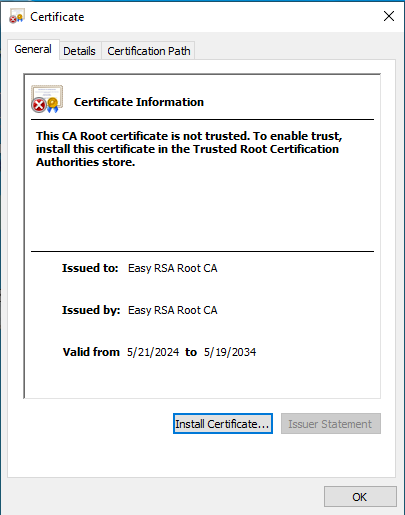
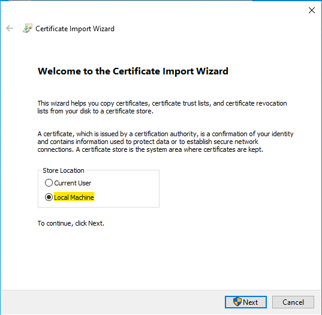
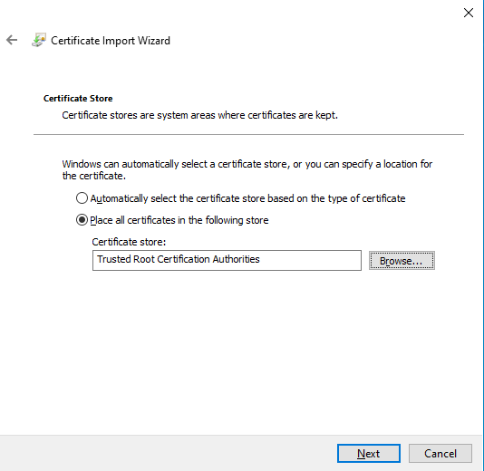
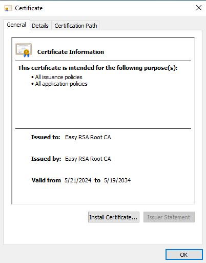

# 讓客戶端信任憑證

Index:
[toc]

# 什麼情況需要手動信任
一般來說，如果你是中繼CA，然後你的客戶端信任你所尋找的Root CA，那只要他能取得你後面這個CA所簽出來的的憑證的Root CA他便會自動信任該憑證

如果你是自己建立一個Root CA，那就需要手動安裝並信任了

# Windows
假設我手動建立了一個Root CA，因為是新的Root CA，沒有相關資訊，所以需要手動加入至「信任的Root CA」

那首先，我們先把Root CA的憑證丟到我要安裝的電腦
然後打開憑證後可以看到尚未信任的狀態，點選install certificate安裝憑證
儲存位置選擇**Local Machine**
然後選擇Place all certificates in the following store所有憑證存放至指定位置
並指定到Trusted Root Certification Authorities信任的根授權機構

完成之後按Next下一步就完成信任了

再打開一次就會是信任狀態了

# Linux
