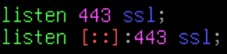
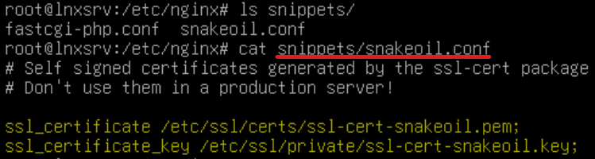
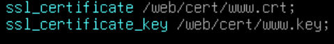
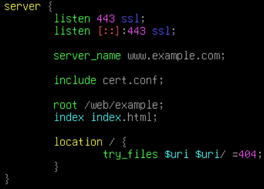
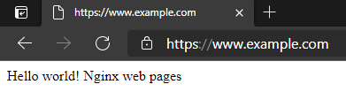

# 架設HTTP站台

Index:
[toc]

# 前置作業
由於架設HTTPS網站需要有憑證，所以記得先去買張憑證，不知道怎麼產CSR的可以參考[使用OpenSSL](./使用OpenSSL產生CSR.md)這篇教學

# 站台設定
其實大致上沒有區別，大部分HTTP怎麼設HTTPS就怎麼設，來看看哪些地方不太依樣

首先是Port，除了把80改成443外，還須注意在Port號後面尾隨`ssl`

我們都知道HTTPS的網頁都會有一張憑證，用於驗證伺服器以及加密網頁的傳輸，所以我們自然要把憑證導入站台設定裡面
具體怎麼導入?可以參考Nginx目錄底下有一個`snippets`目力，裡面有一個`snakeoil.conf`，裡面存著指定憑證路徑的相關設定
當然我們可以直接用，但是你可以搭配Subject alternative name讓所有站童使用相同的憑證，你試想一下，所有站台都用同一張憑證但是卻都獨立設定，後續憑證跟新還要慢慢一個一個改，是不是很麻煩?

所以，讓我告訴你，其實Nginx可以使用`include`把特定設定引入
首先，我們把裡面的設定複製起來後丟在你喜歡的地方(個人會直接在Nginx目錄底下建立`cert.conf`)，然後把憑證的路徑改成你買的憑證的路徑

好了之後回到你的站台設定檔將其引入
需要注意的是，Nginx的站台如果使用相對路徑他會在Nginx的目錄(Debian就是`/etc/nginx`)底下開始搜尋

這樣就設定完了，整體設定像這樣:

# 測試網頁
老規矩，使用`nginx -t`先驗證過不過，出現successful就可以reload(或restart)
然後再用瀏覽器看看是不是可以連上，可以連上就好好欣賞吧

