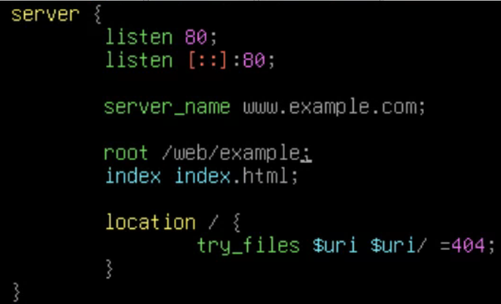

# 架設HTTP站台

Index:
[toc]

# 基本說明
Nginx的設定檔都會在`/etc/nginx`底下，而管理站台的資料夾分別會在底下的`sites-available`和`sites-enabled`，前者用來存放所有站台，後者表示開啟的站台

在`sites-available`裡面有個名叫`default`的檔案，裡面存放的是預設站台的資訊，同時也有大量的註解，可以讓你快速上手Nginx以及一些其他功能的設定值（比如php設定）
如果只要架設一個基本的HTTP站台，可以看到最底下有個`server`區塊，他將最基本的HTTP功能都放入了，複製後新增站台設定檔後根據需求修改設定即可

# 設定基礎HTTP站台
將基本的站台設定複製完後在`sites-available`裡面建立新的設定檔（或者你想倣照著手打也是可以），貼上後根據需求改成你需要的設定即可

在你將你要開啟的站台設定好後建議把`default`從`sites-enabled`移除，放心，`sites-available`的那份不會被移除
接著我們來開啟我們的站台，Nginx不像Apache2一樣有內建的工具，那具體如何開啟？
我們需要使用`ln`這個指令來將`sites-available`內的站台開啟，透過建立`sites-availables`內的站台的Symboilc Link道`sites-enabled`來實現
```bash
# 假設工作目錄在/etc/nginx
# 絕對路徑建立法
ln -s /etc/nginx/sites-available/example sites-enabled/

# 相對路徑建立法
ln -s ../sites-available/example sites-enabled/
```
若你有有用過Apache2並觀察過你會發現2者實現方式其實是一樣的
將Symboilc Link建立好後，再介紹最後一個指令：`nginx -t`

# 測試
建立完成後使用`nginx -t`這個指令就能測試站台的語法是否有錯，如果沒錯就會跳出is ok和successful的字樣
成功後就可以將服務重啟，如果是failed就慨他所提供的錯誤資訊去確認你的設定哪裡有錯誤
服務重啟指令（Debian/Ubuntu）：
```bash
systemctl reload nginx
```
完成之後就可以來欣賞妳的網頁啦
