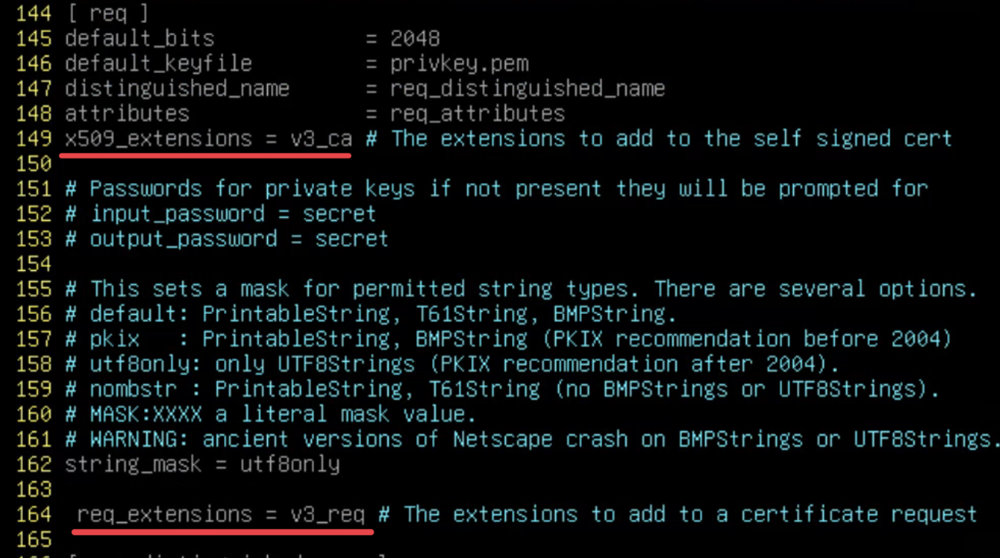
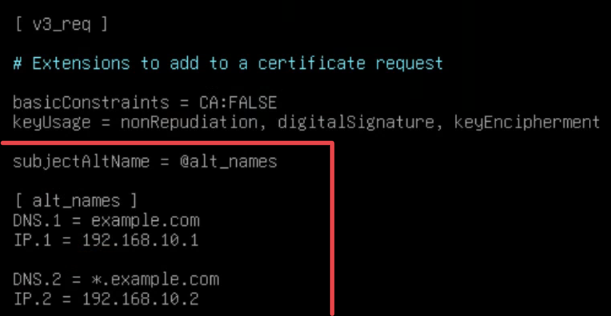
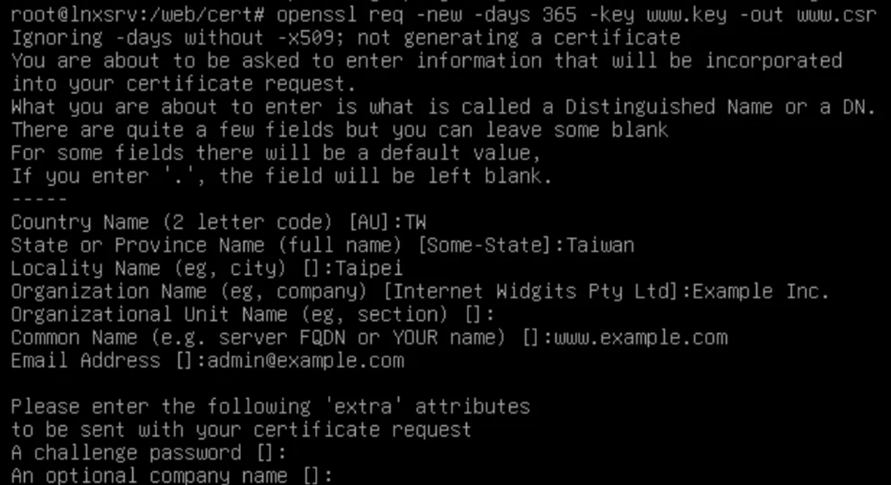

# 使用OpenSSL產生CSR

Index:
[toc]

# 前置作業與說明
憑證做為現在網路環境相當重要的一環，不只可以加密網路連線，也可以用於身份驗證，而產生一個憑證需要先產生CSR後巷CA申請，並等待CA頒發
產生Certificate Signing Request (CSR，憑證簽署要求)的方式雖然有很多，而Linux平臺一般上會使用OpenSSL來產生CSR

具體來說我們會動到哪些設定？
## 現代瀏覽器接受的憑證標準
由於現在的網路環境越來越複雜，所以像這種7x24面向客戶的服務被攻擊的機率大幅增加
只要伺服器與網際網路連線，憑證的私鑰洩漏的機率就會隨著時間增加
為了避免你同一張憑證用太久，同時避免私鑰洩漏卻渾然不知，現代瀏覽器所接受Web Server的憑證最久只能有效2年

而由於現在各大公司由於開放的服務越來越多，以Google為例，已經不是只有`www.google.com`搜尋引擎的網址了，還有Gmail、Youtube、甚至還有GCP，因此現代憑證的某個參數變得越來越常見：Subject alternative name 主題別名
SAN的出現，讓各大公司的開銷得以大幅減少，以往每台機器甚至是每個FQDN都要一張憑證（你能想像你的綽號也要身分證嗎），並且每張憑證申請都要付錢，然後時間到就要去逐張替換，從維護到開發都十分麻煩，所以SAN慢慢成為現代憑證不可或缺的一部份

也由於現在各大瀏覽器的**貼心**，強制你要少申請憑證，所以SAN也被作為現今憑證必須存在的欄位以及參數

# 實作與說明
由於會動到OpenSSL的設定檔，所以我們會需要先備份
```bash
cp /etc/ssl/openssl.cnf /etc/ssl/openssl.cnf.def
```
## 開啟v3_ca的Request功能
SAN由於是一種拓展欄位，所以需要將相關的設定打開
你會需要找到以下2個參數：
- `x509_extensions = v3_ca` 
- `req_extensions = v3_req` (有的系統也是`= v3_ca`)
以Debian 12為例，2個分別會在149行和164行找到，如果是Debian在vim中可以用`/req`找到這2個參數

## 設定Subject Alternative Name
相關擴充設定完成後接著找到`[ v3_req ]`的欄位，在最底下新增`subjectAltName`這個參數
讓我來說明一下圖片中的設定
`subjectAltName`代表的是之後申請的憑證會有哪些別名<span style="color: red">（大小寫注意）</span>
這個參數會指向另一個設定欄位，我們指向的是`alt_names`這個區域

`alt_names`底下會放置subject alternative name的設定
- `DNS.N`代表其他的FQDN，如果使用萬用字元代表該層網域都適用（但只能跨一層，不能跨2層，2層就要`*.*.example.com`
- `IP.N`代表的是IPv4 address，一般只要有`DNS.N`就好

然後`N`自行替換成數字，然後按照順序排列（參考圖片）
至於IP和DNS是IP和DNS交錯使用還是IP和DNS分開都無所謂，只要有按照序列號列出你需要的Subject alternative names就好

# 產生憑證簽署要求
## 產生Private key
在產生CSR之前需要先產生私鑰

### RSA Private key
若要以RSA設定用以下指令
```bash
openssl genrsa -out private_key.key [length]
```
若不在最後面輸入長度，預設是2048，但由於現今的網路標準2048位的RSA金鑰已經不夠安全，因此請至少使用3072或4096位長度的金鑰

### 現代橢圓曲線Private key
以現如今的行業標準橢圓曲線是個更好的方法，可以用更短的長度換取等效安全的RSA
比如P224 = RSA 2048
由於考量到新型的ECDSA使用率越來越高，所以預留使用ed25519 (256 bits) / ed448 (448 bits)簽名的憑證
我們以ed25519為例，我們使用以下指令產生私鑰
```bash
openssl genpkey -algorithm ed25519 -out private.key
```

> 注意ed25519/ed448與x25519/x448兩者不一樣，前者為ECDSA的一種，後者是ECDH標準
> 前者為基於Twisted Edwards curve用於身份驗證的算法（憑證屬於一種身份驗證）
> 後者為ECDH的Key Exchange協定
> 這種基於twisted Edwards curve的ECDSA雖然用於身份驗證的使用率越來越高，但是瀏覽器普遍缺乏支援，可以參考[這個網站](https://caniuse.com/mdn-api_subtlecrypto_sign_ed25519)查看是否支援

如果你希望使用一般的橢圓曲線來產生憑證私鑰，可以使用以下指令列出OpenSSL支援的經典橢圓曲線加密法：
```bash
openssl ecparam -list_curves
```
找到你要的算法後，使用以下指令產出私鑰
```bash
openssl ecparam -name 算法
```

> 有的算法存在漏洞，所以注意算法的選擇

## 設定並產生CSR資訊
完成之後就可以來產生CSR資訊了，使用以下指令：
```bash
openssl req -new -days 365 -key private.key -out example.csr
# -days後面接的是有效時長（單位：天）
# -key後面接的是你的Private key file
```
至於要輸入的欄位就根據你的環境與需求填寫了，我只重點說明Common Name
Common Name是代表要簽給哪台機器的憑證，如果要給好幾個機器或者他有好幾個名字，請回去看[設定Subject Alternative Name](#設定subject-alternative-name)
剩下的欄位解釋可以參考[這篇文章](https://docs.gandi.net/zh-hant/ssl/common_operations/csr.html#cn)
申請的過程大致長得像這樣:
接下來就可以把CSR丟給CA等待憑證簽發下來了

# Reference
[ECS: Creating SSL certificates to support Subject Alternative Names (SANs)](https://www.dell.com/support/kbdoc/zh-tw/000021675/ecs-creating-ssl-certificates-to-support-subject-alternative-names-sans)
[OpenSSL genrsa](https://www.openssl.org/docs/man1.1.1/man1/genrsa.html)
[產生SSL憑證簽署要求(CSR)](https://docs.gandi.net/zh-hant/ssl/common_operations/csr.html)