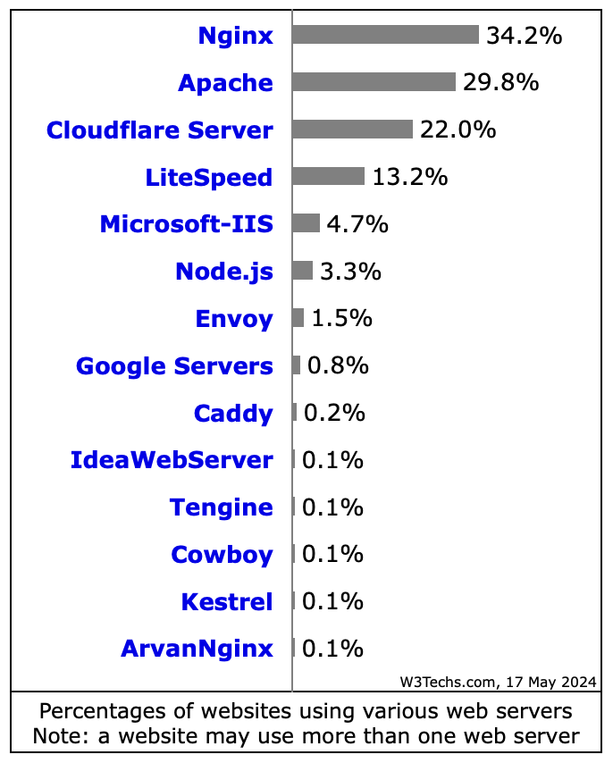
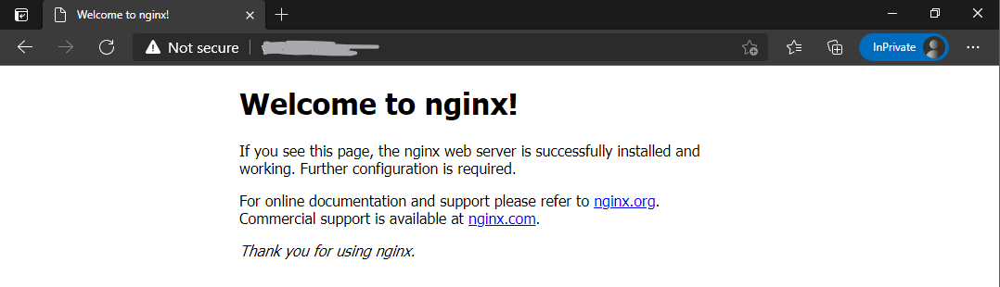

# Nginx 介紹

index:
[toc]

# Nginx是什麼？
Nginx是一個開源的Web Server套件，截止至今年(2024)的5月Nginx市佔率以34.2%**繼續**稱霸著Web Server的市場
除了動態網頁的效率不輸老牌Apache2 (但依舊市占第二)之外，靜態網頁運罪效率比Apache2也更好，以及更容易設定的Load Balancer使其成為市占第一

# Nginx安裝
Debian體系可以使用以下指令安裝：
```bash
apt install nginx
```
與Apache2不同，Nginx在安裝完後服務會是關閉的，需要手動開啟，以下為指令開啟指令和預設站台的網頁
```bash
systemctl start nginx
```


知道怎麼打開Nginx，就可以來[架站](../Basic/HTTP_site.md)了

# Reference
[Usage statistics and market shares of web servers](https://w3techs.com/technologies/overview/web_server)