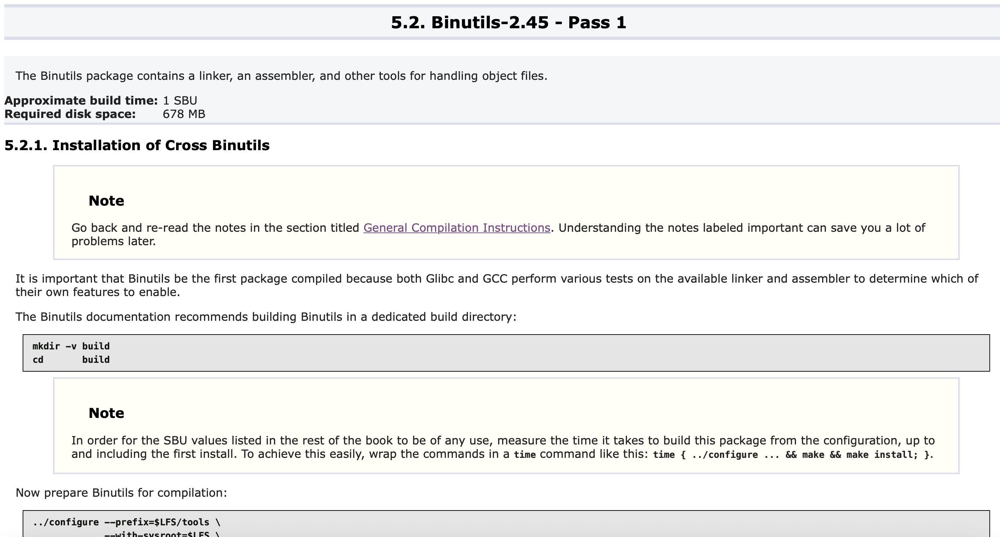

# Compiling LFS rules
在Chapter 5前面有2個重要的Important，第二個Important可能需要額外解釋會比較好理解，說明一下

這個Important主要是在說明後面要編譯套件要做的事情以及預設環境，你只要看到這種標題是套件名稱並且有套件介紹以及說明編譯時長(單位: SBU)和套件大小，如下圖，請做以下這些事
1. 套件都放在`$LFS/sources`底下(書中是/mnt/lfs/sources)
2. 切換目錄到`$LFS/sources`
3. 針對每個套件要做的事情：
   1. 只能用`tar`來解壓縮原始碼(指令是`tar -xf PACKAGE`)
   2. 解壓縮完自行切換到解壓縮後的目錄(書內不會提醒)
   3. 依照書中指示build套件
   4. build完後返回`$LFS`
   5. build完後除非有說明，不然把解壓後的套件刪掉

心得：如果套件標題後面有Pass 1、Pass N代表後面還會用到，如果沒刪掉這些解壓目錄，切換回來後記得`build`裡面的東西刪掉