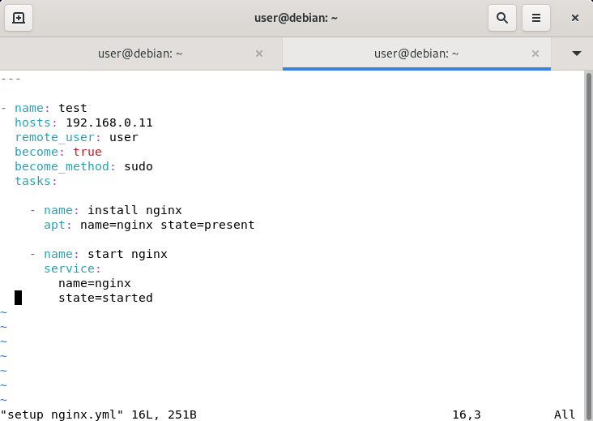
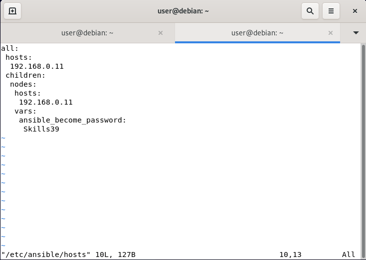

---
tags:
 - Linux
 - Ansible
 - Automation
---

# 臨時抱佛腳 - Ansible快掛了!!!!!

[Toc]

# 53th全國賽要會的模組
- [hostname](https://docs.ansible.com/ansible/2.9/modules/hostname_module.html)
- [Template^*1^](https://docs.ansible.com/ansible/2.9/modules/template_module.html)
- [timezone](https://docs.ansible.com/ansible/2.9/modules/timezone_module.html)
- [user](https://docs.ansible.com/ansible/2.9/modules/user_module.html)
- [service](https://docs.ansible.com/ansible/2.9/modules/service_module.html)
- [apt](https://docs.ansible.com/ansible/2.9/modules/apt_module.html)
- [copy](https://docs.ansible.com/ansible/2.9/modules/copy_module.html)
- [file](https://docs.ansible.com/ansible/2.9/modules/file_module.html)
- [iptables](https://docs.ansible.com/ansible/2.9/modules/iptables_module.html)
- [read_csv](https://docs.ansible.com/ansible/2.9/modules/read_csv_module.html)

# How become
參考試題說明
由於會關閉root的SSH登入，因此要使用user來進行連線
然而絕大部分指令都需要Root權限，因此需要Ansible連線之後提權
Ansible提權的操作稱之**BECOME**，在執行playbook時，預設的連線使用者是root，因此要加上`remote_user`，切記，要選你可以登入的使用者
完成之後在執行playbook時加上`-K`，這樣便可以提示ansible說要提權並詢問密碼
但是Debian預設沒有sudo，若題目要用自帶的`su`怎麼辦? 可以用`--become-method`的參數，支持`sudo`、`su`和`doas`，預設是`sudo`
那可以的話需要提權的playbook最好在裡面補上`become: true`，這樣子便會強制提權

那在執行playbook時候，若沒設定提權密碼又忘記指定`-K`參數會直接導致Ansible程序超時，回報錯誤
那如果希望執行playbook時只要跟使用root帳號登入一樣，直接`ansible-playbook playbook.yml`怎麼辦?
首先針對become-method下手，這個參數可以直接丟到playbook裡面指定，只要把中間的"-"改成"_"就好，然後在後面指定提權方法，像這樣:


接下來就是解決提權密碼的問題，Ansible有很多種驗證方式，那我先以使用變量在庫存中儲存
在Ansible中儲存連線的主機不是在`/etc/ansible/hosts`底下嗎?
那麼我們可以替node建立一個Group，並在這個Group中使用become密碼的方法，那因為時間有限，目前是以明文的方式直接儲存，官方建議密碼應以加密文件儲存

此時密碼如果設定正確便可以不帶`-K`執行需要BECOME的腳本

# 固定語法
```YAML
- name: <NAME>
  hosts: <GP_OR_IP_OR_FQDN>
  become: true
  become_method: su # OR sudo
  tasks:

    - name: <NAME>
      MODULE: funcA=ST funcB=ST ....

.
.
.
```

# APT模組

安裝:
```YAML
    - name: install
      apt: name=套件名稱
```
移除:
```YAML
    - name: install
      apt:
        name=套件名稱
        state=absent
        autoremove=yes
        purge=yes
```
重點參數:
| Parameter  | Option/<span style="color: blue">Default</span>                                       | Comments                                      |
| :---------: | :------------------------------------------------------------------------------------ | :-------------------------------------------- |
| name       | 套件名稱                                                                              | 指定套件，對其安裝、更新、移除等用途          |
| state      | <p>absent <p>build-dep <p>latest <p><span style="color: blue">present</span> <p>fixed | 使用absent可以搭配其他參數來移除套件          |
| purge      | <span style="color: blue">no</span> <p>yes                                            | 若`state=absent`，`purge=yes`會清除套件組態檔 |
| autoremove | <span style="color: blue">no</span> <p>yes                                            | 搭配`state=absent`和`purge=yes`使用           |

# service模組
重點參數:
| Parameter | Option | Comments |
| :-: | :- | :- |
| name | 服務名稱 | 指定服務的名稱，必要的參數 |
| state | <p>reloaded <p>restarted <p>started <p>stopped | 

# hostname
重要參數: name - 更改主機名稱
```YAML
    - name: rename
      hostname: name=要改成的主機名稱
```

# user模組
產生使用者密碼的指令:
```bash
#random hash value
ansible all -i localhost, -m debug -a "msg={{ 'Skills39' | password_hash('sha512') }}"

#controllable hash value
ansible all -i localhost, -m debug -a "msg={{ 'Skills39' | password_hash('sha512', 'slat') }}"
```

簡單的all in one playbook大全:
```YAML
---
- name: user module
  hosts: nodes
  remote_user: user
  become: true
  become_method: su
  tasks:

    - name: add user (non-group)
      user:
        name=test
        shell=/bin/bash
        password="{{ 'Skills39' | password_hash('sha512') }}"

    - name: add user (group)
      user: 
        name=test
        shell=/bin/bash
        group=GROUPNAME
        groups=''
        password="{{ 'Skills39' | password_hash('sha512') }}"

    - name: remove user
      user:
        name=test
        state=absent
        remove=yes 
```

# Template
Ansible中宣告變數的方法:`env`
先告方式參考:
```YAML
...

vars:
  foo: "str"
  dymanic: "str"

...
```
只要在`vars`底下都是變數
Template檔案必須以`.j2`作為副檔名
想快速理解jinja2語法可以參考[這篇文章](https://segmentfault.com/a/1190000018002480)
關於jinja2的寫法:
- 其jinja2作為模板語言的特性更多會在HTML上使用
- 在Ansible中主要使用`{{ vars }}`和`{{ vars | func(args) }}`這種語法為主
- Ansible中也可以直接使用jinja2語法(比如上面那篇user系列)
與大部分程式語言一樣，`vars`欄位也可以直接用雙引號""直接在內宣告字串
Template檔案可以是一個預先寫好的檔案，等需要依情況填入不同內容時再用`{{ vars }}`來透過playbook執行時根據module或handle來改變內容
一個快速的Hello world Template寫法:
```jinja2
Hello {{ dynamic_word }}
``` 
```YAML
---
- name: Template Demo
  hosts: nodes
  remote_user: user
  vars:
    dynamic_word: "world!"
  tasks:

    - name: generation the hello_world.txt
      template:
        src: hello.j2
        dest: /home/user/hello_world.txt

  # verify txt file

    - name: show file context
      command: cat /home/user/hello_world.txt
      register: result

    - name: print stdout
      debug:
        msg: " {{ result.stdout_lines }} "
```
在Ansible中Template模組比較常用的參數如下:
| Parameter | Option/<span style="color: blue">Default</span> | Comments |
| :-: | :- | :- |
| src(必要) |  | Ansible Controller中jinja2 Template的路徑 |
| dest(必要) |  | 被指定的nodes中建檔案的路徑 |
| force | <p>no <p><span style="color: blue">yes</span> | 若為`yes`，複寫檔案 <p>若為`no`，目的存在一樣檔名的檔案遍不傳輸 |
| mode |  | 指定檔案的權限，可用八進制`0644`、引用八進制`"644"`或者符號模式(比如`u+rwx`或`u=rwx,g=rw,o=r`) |
| owner |  | 檔案擁有者，在遠端建立檔案後執行`chown` |
| group |  | 擁有檔案的群組，在遠端建立檔案後執行`chown` |

# copy模組
重點參數:
| Parameter | Option/<span style="color: blue">Default</span> | Comments |
| :-: | :- | :- |
| dest(必要) |  | <p>複製到nodes上的路徑<p>如果`src`是目錄，那到node上也是目錄，並且若`dest`中間有缺的路徑或是以`/`作為結尾，會自動補上<p>若`src`是檔案並且`dest`不是以`/`結尾只要中間有缺少的目錄便會導致執行失敗 |
| src |  | Ansible Controller上的要複製給node的本地路徑 |
| remote_src | <p><span style="color: blue">no</span><p>yes | 如果`yes`，則會從node上面尋找檔案。`no`則反之，在本地尋找 |
| mode |  | 參考[Template](#template)的mode欄位
| owner |  | 調用`chown`更改擁有者 |
| group |  | 調用`chown`更改群組 |

# file模組
重點參數:
| Parameter | Option/<span style="color: blue">Default</span> | Comments |
| :-: | :- | :- |
| path(必要) |  | 要管理的檔案的路徑 |
| state | <p>absent<p>directory<p><span style="color: blue">file</span><p>hard<p>link<p>touch | <p>若為`absent`，將會遞回刪除<p>若是`directory`，中間有缺的目錄都會被新建<p>如果是`file`，將會回傳目標狀態，或者搭配其他功能操作(比如`mode`)，若不存在則會建立新檔案(要建立檔案用`touch`或者其他功能比較好)<p>若是`hard`，建立或修改硬連結<p>若是`link`則會新增或修改連結狀態<p>若是`touch`則會在目標不存在時建立空白檔案 |
| src |  | <p>用於連結檔案用，也就是`state=link`或者`state=hard`<p>以link為例，會在遠端執行`ln -s SRC DEST`這類型操作
| mode |  | 參考[Template](#template)的mode欄位 |
| owner |  | 調用`chown`更改擁有者 |
| group |  | 調用`chown`更改群組 |
|

# iptables模組
重點參數:
| Parameter | Option/<span style="color: blue">Default</span> | Comments |
| :-: | :- | :- |
| table | <p><span style="color: blue">filter</span><p>nat<p>mangle<p>raw<p>security | 要操作的table
| chain |  | 可以是用戶自訂義或是內建的chain，比如`INPUT`、`OUTPUT`或`FORWARD`之類的 |
| policy | <p>ACCEPT<p>DROP<p>QUEUE<p>RETURN | 設定指定(內建)規則鏈的預設原則 |
| source |  | 來源IP位址、網段(IP/mask)。加上`!`會將IP位址not一遍 |
| src_range |  | 來源IP範圍 |
| source_port |  | 來源的單一或範圍port，範圍可以用`FIRST:LAST`來表示 |
| destination |  | 目的IP位址、網段(IP/mask)。加上`!`會將IP位址not一遍 |
| dst_range |  | 目的IP範圍 |
| destination_port |  | 目的的單一或範圍port，範圍可以用`FIRST:LAST`來表示 |
| protocol |  | <p>指定封包協定，包括`tcp`、`udp`、`icmp`、`esp`、`ah`等，也可以使用`all`匹配所有項目<p>若沒使用此參數`all`則是預設參數 |
| ctstate | <span style="color: blue">[]</span> | 連線狀態，可用的參數有`INVALID`、`NEW`、`ESTABLISHED`、`RELATED`、`UNTRACKED`、`SNAT`和`DNAT` |
| to_destination |  | 搭配`DNAT`使用。若沒指定則`DNAT`不會改變Destination IP |
| to_source |  | 搭配`SNAT`使用。若沒指定則`SNAT`不會改變Source IP |
| flush | <P>no<p>yes | <p>刷新指定的規則表或規則鏈<p>若沒指定規則鏈，則會清除指定規則表<p>使用時無視其他參數 |
| jump |  | 用法同原指令的`-j` |

參考:
https://blog.51cto.com/u_15380854/6123081
https://docs.ansible.com/ansible/latest/playbook_guide/playbooks_privilege_escalation.html
https://docs.ansible.com/ansible/latest/plugins/become.html#become-plugins
https://cloudinfrastructureservices.co.uk/how-to-install-ansible-on-debian-11-server/
https://docs.ansible.com/ansible/latest/inventory_guide/intro_inventory.html

https://stackoverflow.com/questions/19292899/creating-a-new-user-and-password-with-ansible
https://docs.ansible.com/ansible/latest/reference_appendices/faq.html#how-do-i-generate-encrypted-passwords-for-the-user-module

https://segmentfault.com/a/1190000018002480

# 註解:
1. 需要了解jinja2語法